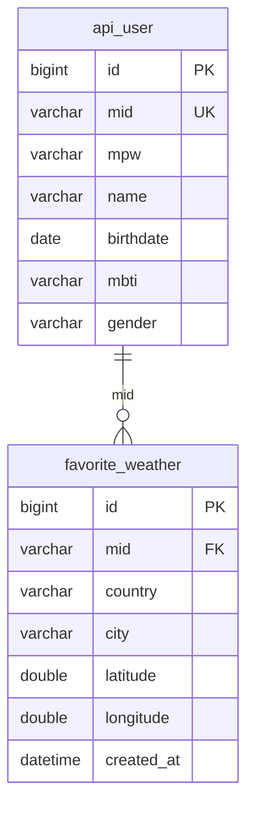

# 🌈 Wheather_Mate

> **Vite 기반의 고성능 실시간 도시별 날씨 검색 웹 서비스**  
> 🔗 [배포 링크] | 📄 [Notion 문서](https://www.notion.so/Wheather_Mate-2df87486686f81638932d4b3b2230e6e)

<br>

## 📖 프로젝트 소개 (About)

**Wheather_Mate**는 React와 Vite로 제작된 빠르고 직관적인 날씨 애플리케이션입니다.  
사용자가 원하는 도시를 검색하여 해당 지역의 현재 날씨 상태를 실시간으로 확인하고 관리할 수 있습니다.

- **제작 기간:** 2025.01.20 ~ 2025.02.12
- **참여 인원:** 5명 (팀장)
- **주요 역할:**
    - 프로젝트 총괄 및 Git 관리
    - UI/UX 초안 작성 및 프론트엔드 개발
    - 현재 위치 호출 및 실시간 날씨 API 연동

<br>

## ✨ 주요 기능 (Key Features)

- **🔍 실시간 날씨 검색:** 도시 이름으로 전 세계 날씨 정보 조회
- **📍 현재 위치 기반 날씨:** 사용자의 GPS 정보를 활용한 자동 날씨 추천
- **💾 즐겨찾기:** 자주 찾는 도시 저장 및 관리 (ERD: `favorite_weather`)
- **📊 사용자 관리:** 회원가입/로그인 및 MBTI/성별 기반 맞춤형 데이터 관리 (ERD: `api_user`)

<br>

## 🛠 기술 스택 (Tech Stack)

| 구분 | 스택 |
| :-- | :-- |
| **Frontend** |   |
| **Backend** | (e.g. Node.js, Express) |
| **Database** | (e.g. MySQL) |
| **Design** |  |
| **Collaboration** |   |

<br>

## 🏗 아키텍처 및 설계 (Architecture & Design)

### ERD (Entity Relationship Diagram)
- **Users (`api_user`)**: 사용자 정보, MBTI, 성별 등
- **Favorites (`favorite_weather`)**: 즐겨찾는 날씨 정보 (도시, 위도/경도)



### API 명세서
- 상세 API 명세는 [Google Docs 링크](https://docs.google.com/document/d/10xTiPFXgw7_SGE0AvhJ2OuKYzbrHXL_TP_xOV4JAUgg/edit?usp=sharing)에서 확인할 수 있습니다.

<br>

## 💭 회고 (Retrospective)

- **[Notion 회고록 링크]** (상세 내용은 링크 참조)
- **배운 점:** React와 Vite 환경에서의 API 연동 및 상태 관리 최적화 경험
- **아쉬운 점:** (e.g. 모바일 환경에서의 일부 UI 호환성 개선 필요)

<br>

## 💻 설치 및 실행 (Installation)

```bash
# 1. Clone the repository
git clone https://github.com/Ihan0316/Wheather.git

# 2. Install dependencies
npm install

# 3. Start development server
npm run dev
```
